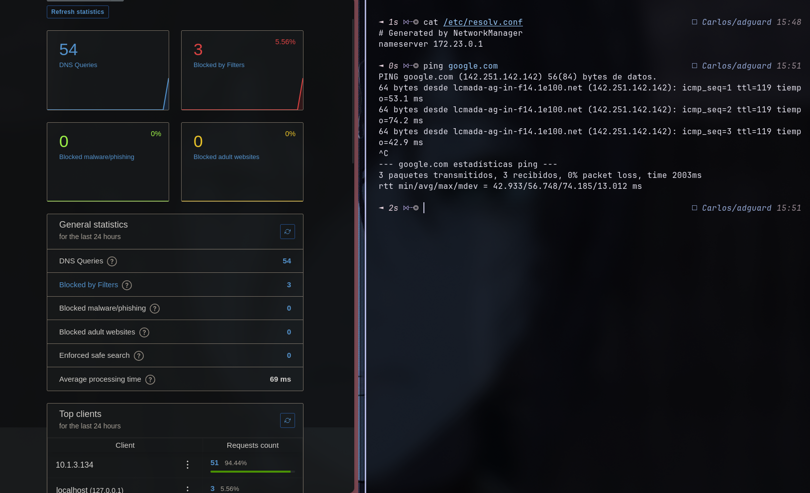
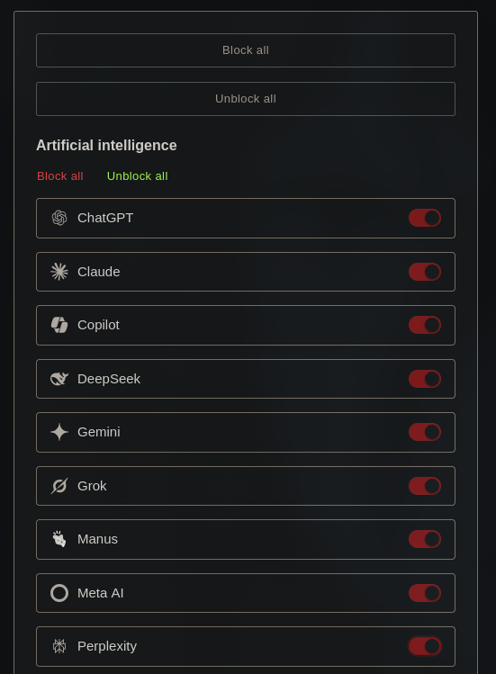
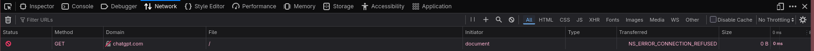
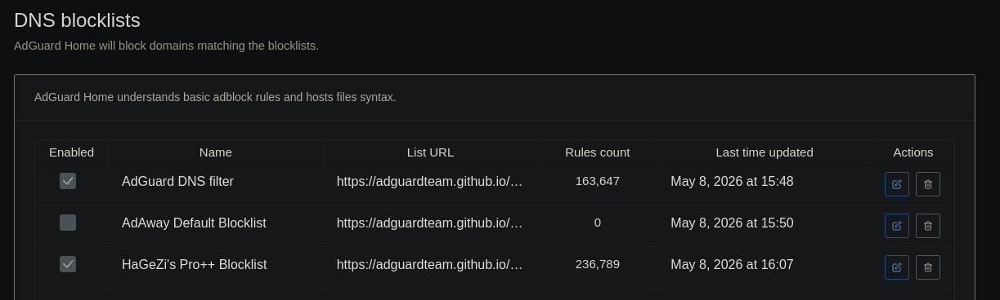

# Configuración de AdGuard Home

Despliegue sencillo de AdGuard Home usando Docker Compose.

## Inicio Rápido

```bash
docker-compose up -d
```

## Cómo Funciona

AdGuard Home actúa como un servidor DNS que filtra anuncios y rastreadores antes de que lleguen a tu dispositivo.

## Configurar como DNS

Para usarlo en tu máquina, configura tu servidor DNS como:
- **IPv4:** `127.0.0.1` (o la IP local de tu máquina para otros dispositivos)

## Vista Previa





